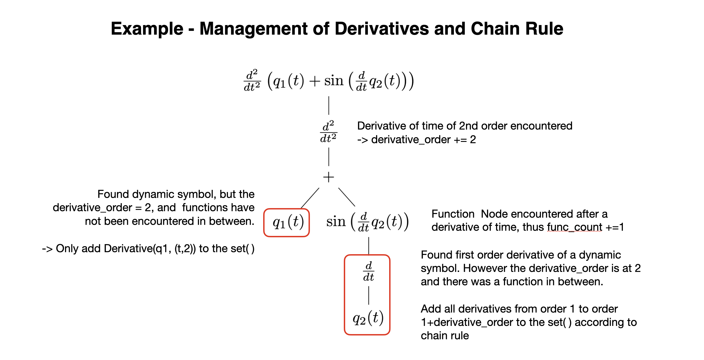
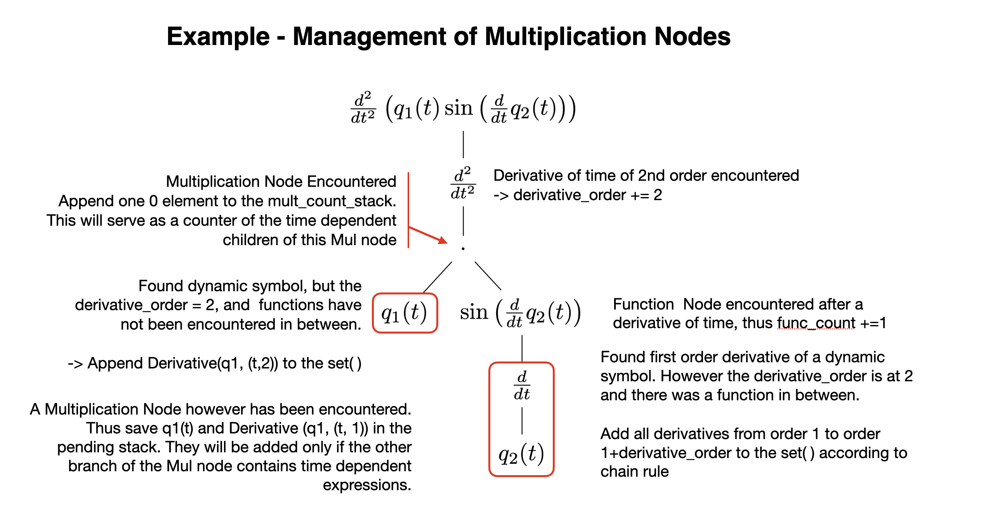

This PR introduces a modification to the `find_dynamicsymbols()` function in the `physics.mechanics` module.

### Reasons

1. The current function returns both the derived and underived dynamicsymbols when called on an expression containing only the derivative of a dynamicsymbol.
2. The function fails to return the dynamicsymbol with the correct derivative order when that dynamicsymbol is found inside an unevaluated time derivative in a SymPy expression.

### Examples

Example of problem 1

```python
expr = sm.Derivative(q2, t)
print(me.find_dynamicsymbols(expr))

# Output
{q2(t), Derivative(q2(t), t)}

# q2(t) should not be present
```

Example of problem 2

```python

# Define the reference frame
N = me.ReferenceFrame('N')

# Define the dynamicsymbols
t = me.dynamicsymbols._t
u1, u2, u3, u4 = me.dynamicsymbols('u1 u2 u3 u4')
q3, q4 = me.dynamicsymbols('q3 q4')

# Define the constants
a, c, d = sm.symbols('a c d')

# Define the velocity vector N_v_Ao
vel_vec = u1 * N.x + u2 * N.y
acc_vec = vel_vec.diff(t, N)

# Create the replacement dictionary
q4_dot = q4.diff()
qd_repl = {q4_dot: u4}

# Create the replacement dictionary for u1(t) and u2(t)
ur_repl = {
    u1: (a * u3 * sm.sin(q3) * sm.sin(q4) + c * u3 * sm.cos(q3 + q4) + d * u3 * sm.cos(q3) + d * u4 * sm.cos(q3)) / sm.sin(q4),
    u2: (-a * u3 * sm.sin(q4) * sm.cos(q3) + c * u3 * sm.sin(q3 + q4) + d * u3 * sm.sin(q3) + d * u4 * sm.sin(q3)) / sm.sin(q4)
}

# Checking for dynamic symbols
print(me.find_dynamicsymbols(acc_vec.xreplace(ur_repl).to_matrix(N)))
print(me.find_dynamicsymbols(acc_vec.xreplace(ur_repl).to_matrix(N).doit()))

# Output
without doit(): {q4(t), u4(t), q3(t), u3(t)}
when doit(): {Derivative(u4(t), t), u4(t), q3(t), u3(t), Derivative(q4(t), t), q4(t), Derivative(q3(t), t), Derivative(u3(t), t)}

# Lead to different results when using doit() or not
```

### Solutions

1. One solution to address point 2) is to use `.doit()` on the expression, which evaluates all unevaluated derivatives. However, this approach can result in long execution times for complex expressions and does not resolve point 1). (TODO - Is this behavior desirable?)
2. Another solution is to implement a function that traverses the expression tree once, checking for conditions to identify dynamicsymbol nodes. During traversal, the function can track encountered operation nodes (*, /, +, -) and function nodes (e.g., `sm.sin`, `sm.Pow`, `sm.log`). This approach should yield a faster and more robust function. It potentially reduces execution time due to fewer traversals compared to the current implementation which traverses twice.

### Detailed Explanation of Chosen Solution → Solution 2

https://docs.sympy.org/latest/tutorials/intro-tutorial/manipulation.html

Definition of two functions, which are meant to check any expression tree node, and determine if that node represents an istance of a **dynamicsymbol** (`dyn_sym(node)`) or a **derivative** of time **of** any order of a **dynamicsymbol** (`der_dyn_sym(node)`).

```python
# Rule 1)
def dyn_sym(node):
    if isinstance(node, AppliedUndef):
        t=me.dynamicsymbols._t
        return node.free_symbols == {t}
    return False

# Rule 2)
def der_dyn_sym(node):
    if isinstance(node, sm.Derivative):
        args0 = node.args[0]
        t=me.dynamicsymbols._t
        if isinstance(args0, AppliedUndef):
            return args0.free_symbols == {t}
    return False
```

**NOTE**

At the moment the current imlpementation of **find_dynamicsymbols()** uses the **atoms()** function in **basic.py**, which transform the tree in a list through the **preorder_traversal(expr)** function in **traversal.py** (Depth-First Search) from which, afterwards, the nodes of interest can be extracted. However this implementation has the problem explained above in the **reasons section** above. Moreover, the current implementation perform the traversal basically 2 times, while only one could be enough for this purpose.

Likewise my implementation has to traverse the tree. To achieve the objective with just one traverse, a custom preorder_traverse() function has to be written, which along traversing checks the conditions (1 and 2) above. Thus at the core of the function there is a recursive part.

```python
def find_dynamicsymbols(expression, exclude=None, reference_frame=None):
    """
        Find all dynamicsymbols in expression.

        Explanation
        ===========

        If the optional ``exclude`` kwarg is used, only dynamicsymbols
        not in the iterable ``exclude`` are returned.

        If we intend to apply this function on a vector, the optional
        ``reference_frame`` is also used to inform about the corresponding frame
        with respect to which the dynamic symbols of the given vector is to be
        determined.

        Parameters
        ==========

        expression : SymPy expression

        exclude : iterable of dynamicsymbols, optional

        reference_frame : ReferenceFrame, optional
            The frame with respect to which the dynamic symbols of the
            given vector is to be determined.

        Examples
        ========

        >>> from sympy.physics.mechanics import dynamicsymbols, find_dynamicsymbols
        >>> from sympy.physics.mechanics import ReferenceFrame
        >>> x, y = dynamicsymbols('x, y')
        >>> expr = x + x.diff()*y
        >>> find_dynamicsymbols(expr)
        {x(t), y(t), Derivative(x(t), t)}
        >>> find_dynamicsymbols(expr, exclude=[x, y])
        {Derivative(x(t), t)}
        >>> a, b, c = dynamicsymbols('a, b, c')
        >>> A = ReferenceFrame('A')
        >>> v = a * A.x + b * A.y + c * A.z
        >>> find_dynamicsymbols(v, reference_frame=A)
        {a(t), b(t), c(t)}

    """

    result_set = set()

    # Derivatives management
    derivative_order = 0
    derivative_stack = []

    # Function management
    func_count = 0

    # Multiplication management
    pending_stack = []
    mult_count_stack = []

    t = dynamicsymbols._t

    # Define the elementary conditions to identify the dynamic symbols

    # Rule 1)
    def dyn_sym(node):
        if isinstance(node, AppliedUndef):
            return node.free_symbols == {t}
        return False

    # Rule 2)
    def der_dyn_sym(node):
        if isinstance(node, Derivative):
            args0 = node.args[0]
            if isinstance(args0, AppliedUndef):
                return args0.free_symbols == {t}
        return False

    # Recursive function to traverse the tree
    def traverse(node):
        nonlocal derivative_order, func_count

        # Check conditions to identify dynamicsymbols
        if der_dyn_sym(node) or dyn_sym(node):
            # If derivatives of time have been traversed to arrive at this node
            if derivative_order:
                if len(mult_count_stack) > 0:
                    # If there are elements in the mult_count_stack, meaning we are within a multiplication context

                    mult_count_stack[-1] += 1
                    # Increment the top element of the mult_count_stack to count the current node as a time-dependent child

                    symbols = [Derivative(node, (t, i)) for i in range(0, derivative_order)]
                    # Create a list of derivatives of the current node with respect to time from 0 to the current derivative_order
                    # as dictated by the chain rule.

                    pending_stack.extend(symbols)
                    # Append these symbols to the pending_stack for later processing

                if func_count > 0:
                    # If func_count is non-zero, meaning we are within a function context (e.g., sm.Function or sm.Pow)

                    derivatives = [Derivative(node, (t, i)) for i in range(0, derivative_order + 1)]
                    # Create a list of derivatives of the current node with respect to time from 0 to the current derivative_order
                    # as dictated by the chain rule.

                    result_set.update(derivatives)
                    # Add these derivatives to the result_set

                else:
                    # If func_count is zero, meaning we are not within a function context

                    result_set.add(Derivative(node, (t, derivative_order)))
                    # Add the derivative of the current node with respect to time to the result_set

            # If derivatives of time have NOT been traversed to arrive at this node
            else:
                result_set.add(node)

            # If you found a dynamic symbol, or one of its derivatives, start backtracking = return
            return

        # If the current node is a Derivative of time, increase the derivative_order
        # Save the order associated with the latest traversed Derivative node in a stack
        if isinstance(node, Derivative) and node.args[1][0] == t:
            time_derivative_order = node.args[1][1]
            derivative_stack.append(time_derivative_order)
            derivative_order += time_derivative_order

        # If the node is a sm.Function (sm.log, sm.exp, ...) or is a sm.Pow, increase the count of functions
        # This is useful to keep track of derivatives of functions, which will then require the use of the chain rule
        if derivative_order > 0:
            if isinstance(node, Function) and not dyn_sym(node) or isinstance(node, Pow):
                func_count += 1

        # If the node is a Multiplication, add an element to the mult_count_stack to keep track of how many time-dependent children that node has
        if derivative_order > 0:
            if isinstance(node, Mul):
                mult_count_stack.append(0)

        # Call the recursion on children if we are in a node sm.Basic
        if isinstance(node, Basic):
            for arg in node.args:
                traverse(arg)

        # Additional handling for Matrix nodes
        if isinstance(node, Matrix):
            for element in node:
                traverse(element)

        # Management of Multiplication nodes encountered in child branches of Derivatives(t) nodes
        if derivative_order > 0:
            if isinstance(node, Mul):
                if mult_count_stack[-1] > 1:
                    # If the top of the mult_count_stack is greater than 1, it means there are multiple
                    # time-dependent children in this multiplication node

                    n = mult_count_stack[-1] * derivative_order
                    # Get the count of time-dependent children from the top of the stack

                    result_set.update(pending_stack[-n:])
                    # Add the last 'n' elements from the pending_stack to the result_set
                    # These are the time-dependent children

                    del pending_stack[-(n-1):]
                    # Remove the processed elements from the pending_stack except for one
                    # which is left for further processing

                    mult_count_stack.pop()
                    # Remove the top element from the mult_count_stack as it has been processed

                    if mult_count_stack:
                        mult_count_stack[-1] += 1
                        # If there are still elements in the mult_count_stack, increment the top element
                        # This indicates that the parent multiplication node now has one more
                        # time-dependent child

                else:
                    # only 1 or less children

                    n = mult_count_stack[-1] * derivative_order
                    # Get the count of time-dependent children (which is 1 or less)

                    del pending_stack[-n:]
                    # Remove the processed elements from the pending_stack

                    mult_count_stack.pop()
                    # Remove the top element from the mult_count_stack as it has been processed

        # Update the Function count when encountering a Function node while backtracking
        if derivative_order > 0:
            if isinstance(node, Function) and not dyn_sym(node) or isinstance(node, sm.Pow):
                func_count -= 1

        # Update the Derivative order count when encountering a Derivative(t) node while backtracking
        if isinstance(node, Derivative) and node.args[1][0] == t:
            derivative_order -= derivative_stack.pop()

    # Manage the vector case
    if isinstance(expression, Vector):
        if reference_frame is None:
            raise ValueError("You must provide reference_frame when passing a "
                             "vector expression, got %s." % reference_frame)
        else:
            expression = expression.to_matrix(reference_frame)

    # Start traversal
    traverse(expression)

    # Manage the excluded symbols
    if exclude:
        if iterable(exclude):
            exclude_set = set(exclude)
        else:
            raise TypeError("exclude kwarg must be iterable")
    else:
        exclude_set = set()

    return result_set - exclude_set

```






### Performances

```python
# Create a complex expression
expr = (
    q[0] + sm.Derivative(q[0], t) + sm.Derivative(q[0], t, t) + sm.sin(q[1]) * sm.cos(sm.Derivative(q[1], t)) +
    q[2] * sm.Derivative(q[2], t) + sm.Derivative(sm.sin(q[2] * t), t) + sm.Derivative(q[3], t, t) * sm.Derivative(q[3], t) +
    sm.sin(q[4] + sm.Derivative(q[4], t) + sm.Derivative(q[4], t, t)) +
    sm.exp(q[5]) * sm.Derivative(q[5], t) + sm.Derivative(sm.exp(q[5]), t) +
    sm.Derivative(q[6] * sm.sin(q[6]), t) + sm.Derivative(q[7], t) * sm.Derivative(q[7], t, t, t) +
    q[8] * sm.Derivative(q[8], t, t) + sm.sin(q[8] + sm.Derivative(q[8], t)) +
    sm.Derivative(q[9] * sm.exp(q[9] * t), t) + sm.Derivative(sm.cos(q[9] * t), t, t)
)

# TEST

# Notice that to produce the (almost) correct result the old function has to be run on exdoit
# and not expr.
exdoit=expr.doit()

# Time the traversal function using timeit
time_taken_new = timeit.timeit(lambda: find_dynamicsymbols_new(expr), number=1000)
print(time_taken_new/1000)

time_taken_old = timeit.timeit(lambda: me.find_dynamicsymbols(exdoit), number=1000)
print(time_taken_old/1000)

print(time_taken_new/time_taken_old)

# OUTPUT
new function: 0.0009665375810000114
old function: 0.0003731794580016867
The new function execution time is 2.590007462296177 the one of the old
```

If instead you also consider the time spent in the doit() process:

```python
# Create a complex expression
expr = (
    q[0] + sm.Derivative(q[0], t) + sm.Derivative(q[0], t, t) + sm.sin(q[1]) * sm.cos(sm.Derivative(q[1], t)) +
    q[2] * sm.Derivative(q[2], t) + sm.Derivative(sm.sin(q[2] * t), t) + sm.Derivative(q[3], t, t) * sm.Derivative(q[3], t) +
    sm.sin(q[4] + sm.Derivative(q[4], t) + sm.Derivative(q[4], t, t)) +
    sm.exp(q[5]) * sm.Derivative(q[5], t) + sm.Derivative(sm.exp(q[5]), t) +
    sm.Derivative(q[6] * sm.sin(q[6]), t) + sm.Derivative(q[7], t) * sm.Derivative(q[7], t, t, t) +
    q[8] * sm.Derivative(q[8], t, t) + sm.sin(q[8] + sm.Derivative(q[8], t)) +
    sm.Derivative(q[9] * sm.exp(q[9] * t), t) + sm.Derivative(sm.cos(q[9] * t), t, t)
)

# TEST

# Time the traversal function using timeit
time_taken_new = timeit.timeit(lambda: find_dynamicsymbols_new(expr), number=1000)
print(time_taken_new/1000)

time_taken_old = timeit.timeit(lambda: me.find_dynamicsymbols(expr.doit()), number=1000)
print(time_taken_old/1000)

print(time_taken_new/time_taken_old)

# OUTPUT
new function: 0.0008426841919972504
old function: 0.011880838252000103
The new function execution time is 0.07092800811890415 the one of the old
```

Another example:

```python
# Create a complex expression
expr = (sm.Derivative(sm.sin(sm.Derivative(sm.Derivative(1/(q1 + q2)*(q1*q2**2)) *
sm.Derivative(1/(q3 + q4)*(u1*u2**2)))+ u3) + u4/sm.Derivative(1/(q1 + q2)*(q1*q2**2))))

# TEST

# Notice that to produce the (almost) correct result the old function has to be run on exdoit
# and not expr.
exdoit=expr.doit()

# Time the traversal function using timeit
time_taken_new = timeit.timeit(lambda: find_dynamicsymbols_new(expr), number=1000)
print(time_taken_new/1000)

time_taken_old = timeit.timeit(lambda: me.find_dynamicsymbols(exdoit), number=1000)
print(time_taken_old/1000)

print(time_taken_new/time_taken_old)

# OUTPUT
new function: 0.0015730405220019748
old function: 0.0036925318540015723
The new function execution time is 0.4260059450258448 the one of the old
```

### Log of Activities

**25th of May** - Spend all day understanding how the current_implementation of find_dynamicsymbols works. Understood advanced expression manipulation, and recursion on expression trees.

**26th of May** - During all day I implemented a first draft of the function, the remaining problem where the managment of sm.Pow and of sm.Mult nodes encountered during traverse.

**27th of May** - Spent the evening completing the missing components, testing performances, and documenting the code.

**28th of May** - Completeing documentation
